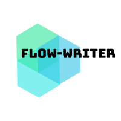

# Flow Writer



[](https://travis-ci.org/raufer/flow-writer)

Install via `pip`:

```bash
pip install git+https://github.com/raufer/flow-writer.git
```

## Basic Usage

**Example: Constructing ML pipelines**

We’ll be making use of `pandas` and `scikit-learn` for this illustration. But first we need some data to work with:

|    | name   |   age |   score | language   |   exam(min) | feedback-questionnaire   |
|---:|:-------|------:|--------:|:-----------|------------:|:-------------------------|
|  0 | Bob    |    30 |     100 | python     |         120 | AABB                     |
|  1 | Joe    |    17 |     110 | haskell    |          90 | BACB                     |
|  2 | Sue    |    29 |     170 | Python     |          90 | AABA                     |
|  3 | Jay    |    20 |     119 | JAVA       |         110 | BBCC                     |
|  4 | Tom    |    38 |     156 | java       |         100 | ACCB                     |

Let’s suppose this is the data available for a recruitment process. The data needs to be cleaned and some features extracted. We’ll be in charge of assembling a transformation pipeline to prepare this data for model scoring. The transformations will consist of some simple data cleaning tasks along and some steps to extract features from numerical data as well as from text data.

For now we have two requirements:

- We want to express our transformations in their natural form, as functions, without a need to wrap them in some class.

- Logically related transformation steps should be allowed to be replaced by an abstraction that represents their composition.

First, we need a way of lifting a function to our dataflow context. Much in the way as the TransformerMixin and Transformer traits fulfil the contract requirements to create pipelines in scikit-learn and spark, respectively. We want to be able to do it by means of a just a decorator.
Our pipeline will start with two simple cleaning steps.

```python
from flow_writer.abstraction import pipeline_step


@pipeline_step()
def step_lowercase(df, col):
    """
    Converts all the strings of 'col' to lowercase.
    """
    df.loc[:, col] = df.language.map(str.lower)
    return df


@pipeline_step()
def step_filter_numeric(df, col, threshold):
    """
    Filters all rows whose value in 'col' < 'threshold'
    """
    return df[df[col] > threshold]
```
We lift the functions by marking them with `pipeline_step`. Furthermore the decorator shouldn’t be destructive, i.e. the function is to be used exactly in the same way outside of our context.

Then we have two steps that extract features from text data:

```python
@pipeline_step()
def step_dummify(df, col, outputcol, sparse=False):
    """
    Binarize labels in a one-vs-all fashion.
    By default the return is given in a dense represententation.
    If a sparse representation is required, set sparse='True'
    """
    enc = LabelBinarizer(sparse_output=sparse)
    enc.fit(df[col])
    df.loc[:, outputcol] = pd.Series(map(str, enc.transform(df[col])))
    return df


@pipeline_step()
def setp_satisfaction_percentage(df, col, outputcol):
    """
    A satisfatory answer is assumed by a "A" or a "B"
    "C" represents an unsatisfactory asnwer.
    perc = ["A" || "B"] / # questions
    """
    df.loc[:, outputcol] = df[col].apply(lambda x: len(x.replace("C", ""))/len(x))
    return df
```

To finish we address the numerical columns with two more steps:

```python
from sklearn.preprocessing import StandardScaler
from sklearn.preprocessing import MinMaxScaler


@pipeline_step()
def step_standard_scale(df, col, outputcol, with_mean=True, with_std=True):
    """
    Standardize features by removing the mean and scaling to unit variance of 'col'

    Standardization of a dataset is a common requirement for many machine learning estimators:
    they might behave badly if the individual feature do not more or less look like standard normally distributed data
    (e.g. Gaussian with 0 mean and unit variance).

    'with_mean': If True, center the data before scaling.
    'with_stf': If True, scale the data to unit variance (or equivalently, unit standard deviation).
    """
    scaler = StandardScaler(with_mean=with_mean, with_std=with_std)
    scaler.fit(df[col].reshape(-1, 1))
    df.loc[:, outputcol] = scaler.transform(df[col].reshape(-1, 1))
    return df


@pipeline_step()
def step_scale_between_min_max(df, col, outputcol, a=0, b=1):
    """
    Transforms features by scaling each feature to a given range.
    The range to scale is given by ['a', 'b]. Default [0, 1].
    """
    scaler = MinMaxScaler(feature_range=(a, b))
    scaler.fit(df[col].reshape(-1, 1))
    df.loc[:, outputcol] = scaler.transform(df[col].reshape(-1, 1))
    return df
```

To bundle together a set of logically related steps we need something like a `Stage` abstraction, to be constructed in the following way:

```python
stage_cleaning = Stage("cleaning-stage",
    step_dummify(col="language"),
    step_filter_numeric(col="age", threshold=18)
)
```

Notice that we are making use of a *curry* operator. We are locking the parameters that parameterize the behaviour of each step but we are leaving the data signal `df` as a free variable that will have its value injected at the proper time.

The remaining two stages:

```python
stage_text_features = Stage("process-text-features",
    step_lowercase(col="language")(outputcol="language-vec")(sparse=False),
    setp_satisfaction_percentage(col="feedback-questionnaire", outputcol="satisfaction-percentage")
)

stage_numerical_features = Stage("process-numerical-features",
    step_standard_scale(col="language", outputcol="language-scaled"),
    step_scale_between_min_max(col="exam(min)", outputcol="exam(min)-scaled")(a=0, b=1)
)
```

A second level of abstraction, `Pipeline`, is also allowed to improve semantics.

```python
pipeline = Pipeline("feature-extraction-pipeline",
    stage_cleaning,
    stage_text_features,
    stage_numerical_features
)
```
To trigger the execution of the pipeline, a data signal is needed. Moreover, the caller should have complete control over the execution workflow.

We should be able to run it end to end:

```python
result = pipeline.run(df)
```

A specific step:

```python
df_result = pipeline.run_step(df, 'step_a')
```

Or run from the beginning until the specified location.

```python
df_result = pipeline.run_until(df, 'stage preprocess/step_a')
```

Every step should is performed in a *lazy* way; the computations are just actually performed when the result is needed. 
This is effectively a generator representing the whole execution of the pipeline, step by step.

```python
gen = pipeline.run_iter_steps(df)

df_intermediary_1 = next(gen)
df_intermediary_2 = next(gen)
df_intermediary_3 = next(gen)
```

Further documentation can be found [here](https://raufer.github.io/2018/02/08/poc-dataflow-for-ml/).

### Proof of concept for constructing ML pipelines

This repository serves as first trial for a proof of concept for what I believe to be a proper way of designing and managing machine learning pipelines.
The proposed design pattern is framework agnostic makes and extensive use of *dataflow programming* as well as *currying*.

[This blog post](https://raufer.github.io/2018/02/08/poc-dataflow-for-ml/) discusses the motivation behind the work with great detail and provides examples of usage.

Keeping data transformations in their natural form, as functions, results in a cleaner way of creating workflows.

We propose a minimalist thin layer to support the development of ML pipelines. It should be framework agnostic and assume very little about the user might want to do. The abstractions should provide a simple and effective way to manage complex machine learning workflows.

#### Desirable properties

- Testability concerns should be addressed at the library design phase. The pipeline and associated components should be easily tested.

- The caller should have complete control over the execution workflow. This is specially important for debugging, where we might need to probe the signal at an intermediary step for a closer inspection. A lazy execution mode should also be available for a finer execution control.  

- Side effects managing. Error handling and persistence are two important in a production environment and they should be handling at the library layer, which creates the opportunity to factor out behaviour common to all of the pipelines. The data scientist ideally should not need to worry about these boring details.

- Templating. We should be able to start from a base pipeline and derive new ones by making changes to the parameters of the base computational description. A possible scenario of this feature in ML pipelines would be parameter tuning. You should be able to easily span new similar pipelines by applying small variations to a base one.

- Self documenting. To share with other team members, or for more generic documentation purposes, the pipelines should ideally carry with them a description of the transformations being applied.

Visually, these are the different modules identified as desirable of the proposed pipeline design pattern.


Ideally, a data scientist should be focused almost entirely on the *data transformations* layer, defining simple, testable functions. These functions should then be effortless *lifted* to the pipelining context, which adds the required extra functionality, respecting the desirable design properties.
